# Enterprise Web Development - Assignment 1.

__Name:__ Yiming Hu

## Overview.

+ Authentication with Supabase
+ Private and public routes
+ Paging in the "Movies" and "Actors" pages
+ Filters on the Movies page and the Actors page
+ Movie details page to see cast list and similar movies
+ Actors' page
+ Actor details page
+ Caching of movie, actor api requests
+ Current user's favourite movies and actors and must-see movies stored in Supabase's database
+ Creation of personal Fantasy movie
+ View details of your personal Fantasy movie, posters, actors and actresses

## Feature Design.

#### Authentication using Supabase

> Only logged in users can access all features of the site.

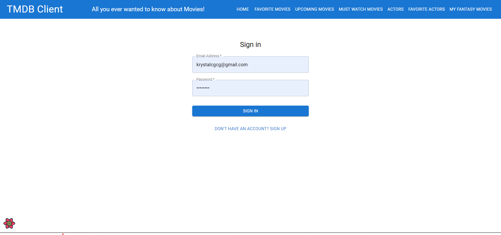

> Only Email Authentication is enabled. So user has to signup using their email id. And should be able to Login.

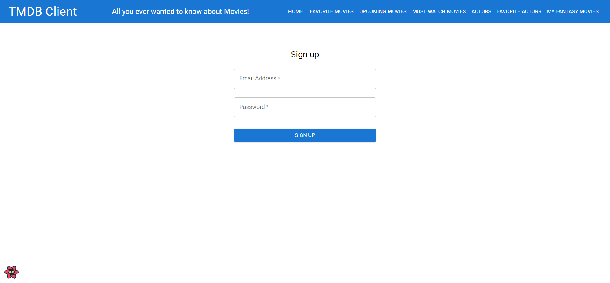

#### Private and Public routes

> Public users can only access the home page where all films and actors are listed. Other pages can only be accessed after logging in. In the absence of a login, if the user clicks any other button, the login screen will prompt the user to log in.

#### Pagination in Home Page, UpComing Movie Page, Actors Page

> Home Page 

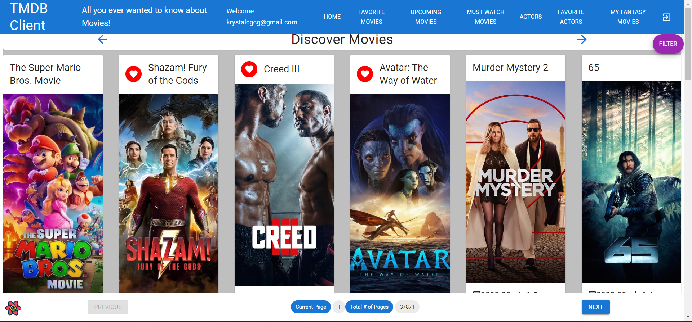

> UpComing Movie Page

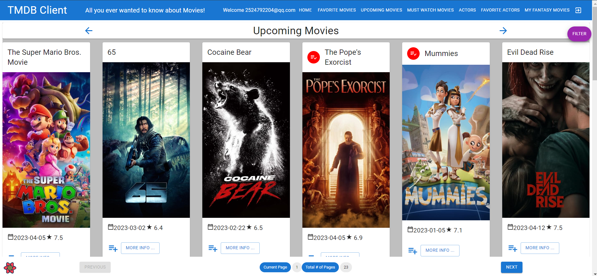

> Actors Page

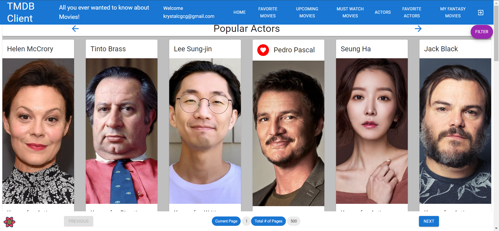

#### Favourite Movies and Actors Pages , Must Watch Movies Page

> Favourite Movies Page

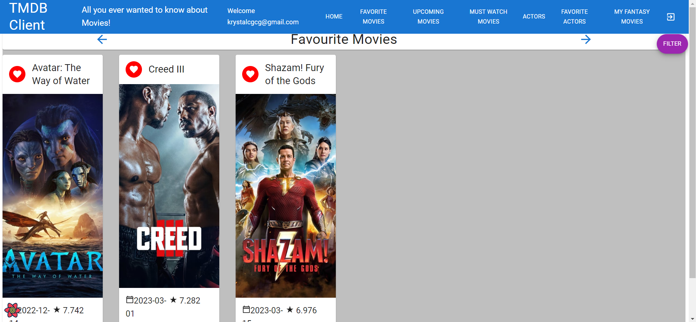

> Favourite Actors Page

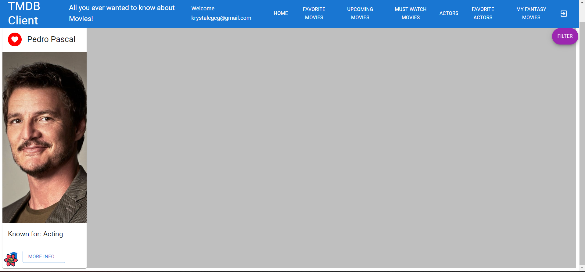

> Must Watch Movies Page

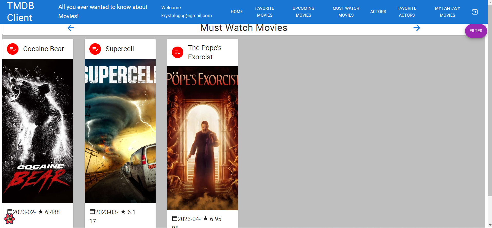

#### Movie Details feature.

> Showing a list of movie posters and other details and cast lists (click to jump to the corresponding cast details page) and a list of movies similar to this movie (click to jump to the corresponding movie details page)

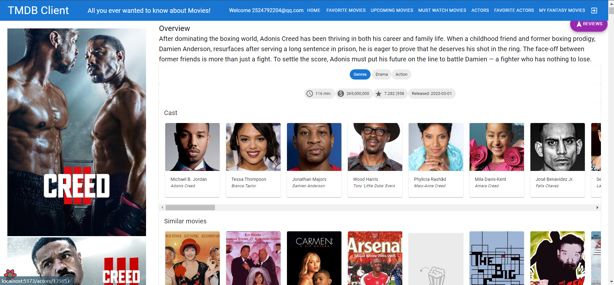

#### Actor Details feature.

> Showing a list of posters and other details of actors and actresses and a list of movies they have appeared in (click to jump to the corresponding movie details page)

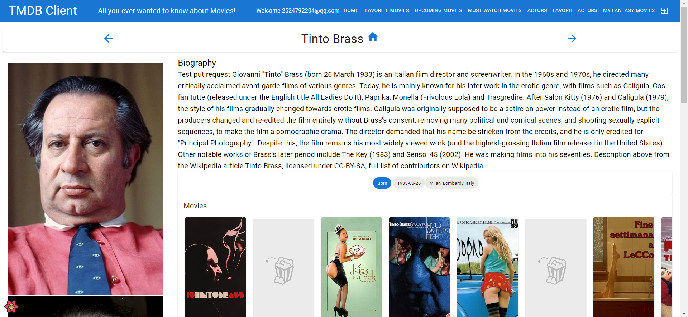

#### Fantasy Movie feature.

> Show the list of fantasy movies created by the current user

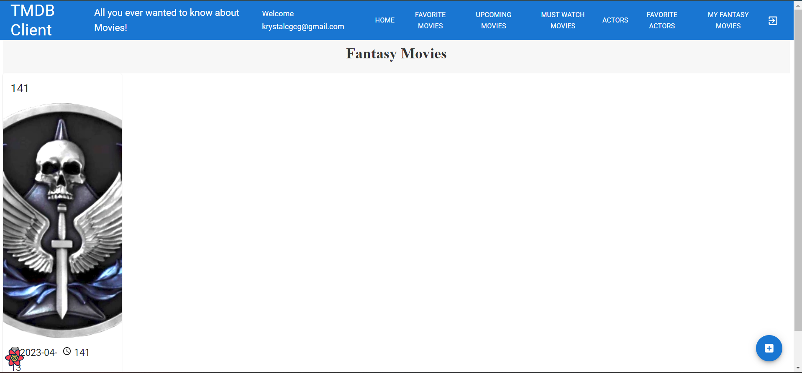

> Clicking on the Create button in the bottom right corner will take you to the Create a personal fantasy movie page

> Click on the movie card in the list to see the poster for the fantasy movie and details including photos and names of the actors involved (click to go to the actor's details page)

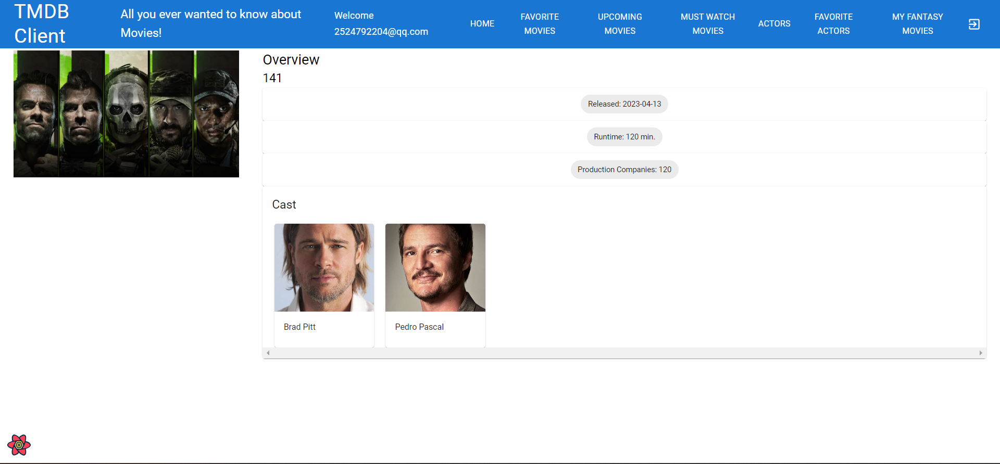

## Authentication.

#### Routes that are public/protected (require authentication)
+ / (Public) - List movies with basic information
+ /movies/upcoming - List upcoming movies with basic information
+ /actors (Public) - List actors with basic information
+ /movies/{movie_id} (Protected) - Detailed information on a specific movie
+ /movies/favourites (Protected) - Mark movies as favourite
+ /movies/mustWatches (Protected) - Mark upcoming movies as must watch
+ /reviews/{review_id} (Protected) - The full text of a movie review
+ /reviews/form (Protected) - Write a review
+ /actors/{actor_id} (Protected) - A specific actor's bio
+ /actors/favourites (Protected) - Mark actors as favourite
+ /fantasy (Protected) - List basic information about the current user's fantasy movie
+ /fantasy/:id (Protected) - Specify the details of the specific fantasy movie
+ /fantasy/create (Protected) - Create the current user's own fantasy movie

#### Protected features

> If the user is not logged in, clicking the button on any page other than the public page will always remind the user to log in

#### Supabase 

> Using Supabase to authenticate users

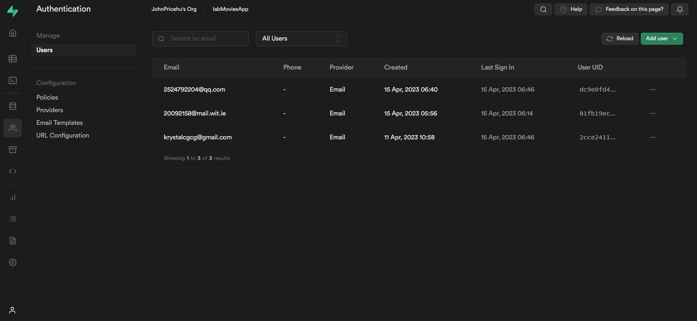

> Use Supabase to store details of your favourite movies and actors as well as must watch movies and created fantasy movies

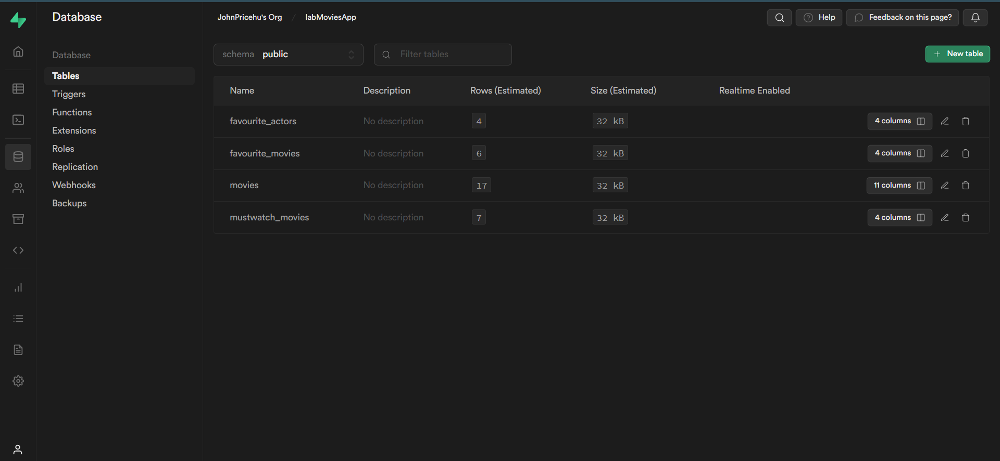
## Deployment 

> Deployment with vercel

https://lab-movies-app-dp5z.vercel.app/

Username: 20092158@mail.wit.ie ; Password: 19991210

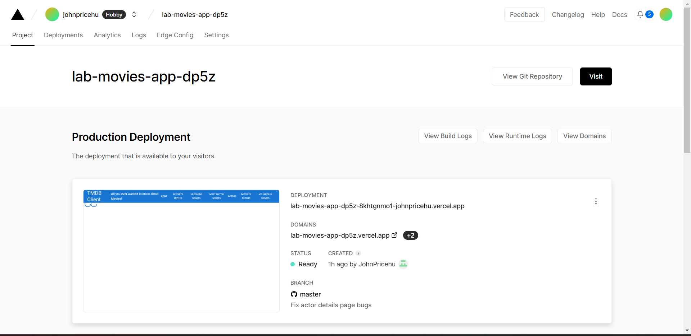

